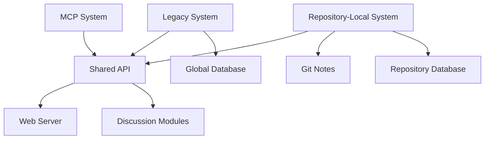

# SVCS System Architecture & Transition Documentation

## Overview

SVCS is currently undergoing a major architectural transition from a centralized system to a distributed, git-integrated system. This document provides clear naming conventions and module organization to help developers navigate the codebase during this transition.

## 🏗️ **System Architecture Overview**

### **PART 1: Legacy System (Global Centralized)**
- **Database**: `~/.svcs/global.db` (centralized, system-wide)
- **Project Identification**: Directory-based tracking
- **Git Integration**: Post-commit hook only
- **Collaboration**: Manual project registration and global database sync
- **Status**: Legacy, being phased out

### **PART 2: Repository-Local System (Git-Integrated)** ⭐ *Target Architecture*
- **Database**: `{project}/.svcs/semantic.db` (per-repository)
- **Project Identification**: Git repository-based
- **Git Integration**: Full git workflow (commit/merge/push/pull hooks)
- **Collaboration**: Git notes (`refs/notes/svcs-semantic`)
- **Status**: Current development focus, target architecture

### **PART 3: MCP System (AI Integration)**
- **Purpose**: Model Context Protocol server and installable tools
- **Integration**: Works with both Legacy and Repository-Local systems
- **Dependencies**: Shared components via `.svcs/api.py`
- **Status**: Active development, modern AI interface

---

## 📁 **Module Organization & Naming Conventions**

### **Legacy System Modules** (`legacy-*` prefix in discussions)
```
svcs.py              # Legacy main CLI
svcs_analytics.py    # Legacy analytics
svcs_quality.py      # Legacy quality analysis
svcs_web.py         # Legacy web interface
svcs_discuss.py     # Legacy discussion features
svcs_ci.py          # Legacy CI integration
```

### **Repository-Local System Modules** (`repo-*` prefix in discussions)
```
svcs_repo_local.py     # Core repository-local database & git notes
svcs_repo_hooks.py     # Git hooks manager (commit/merge/push/pull)
svcs_repo_analyzer.py  # Semantic analysis for repo-local system
svcs_multilang.py      # Multi-language AST analysis
svcs_local_cli.py      # CLI for repository-local operations
```

### **MCP System Modules** (`mcp-*` prefix in discussions)
```
svcs_mcp/
├── svcs_repo_local_core.py    # MCP server core
├── __init__.py                # MCP package initialization
└── [other MCP components]     # MCP-specific implementations
```

### **Shared Components** (`shared-*` prefix in discussions)
```
.svcs/api.py          # Shared API layer (used by MCP, web, discuss)
svcs_web_server.py    # Web server (transitioning to repo-local)
setup.py              # Installation and packaging
install.py            # Global installation script
```

---

## 🔄 **System Dependencies & Interactions**



### **Dependency Matrix**
| Component | Depends On | Used By |
|-----------|------------|---------|
| `.svcs/api.py` | Core systems | MCP, Web, Discussion |
| `svcs_repo_local.py` | Git, SQLite | Repository-Local CLI, Hooks |
| `svcs_repo_hooks.py` | Repository-Local core | Git hooks |
| `svcs_multilang.py` | AST parsers | Both Legacy and Repo-Local |

---

## 📋 **PART 2 Transition Plan: Legacy → Repository-Local**

### **Phase 1: Parallel Operation** ✅ *Current*
- Both systems operational
- Repository-Local system fully implemented
- Migration tools available (`SVCSMigrator`)

### **Phase 2: User Migration** 🚧 *In Progress*
- Users encouraged to run `svcs init` in repositories
- Documentation updated to prefer Repository-Local commands
- Legacy system marked as deprecated

### **Phase 3: Legacy Deprecation** 📅 *Planned*
- Legacy system removed from main distribution
- Repository-Local becomes primary system
- MCP system fully integrated

---

## 🛠️ **Development Guidelines**

### **When Working on Features:**

1. **Repository-Local System** (Preferred):
   - Use `repo-*` prefix when discussing
   - Focus on `svcs_repo_*.py` modules
   - Ensure git integration and notes sync
   - Test with `svcs init` workflow

2. **Legacy System** (Maintenance Only):
   - Use `legacy-*` prefix when discussing
   - Minimal changes, bug fixes only
   - No new features

3. **MCP System**:
   - Use `mcp-*` prefix when discussing
   - Ensure compatibility with Repository-Local system
   - Focus on AI integration and modern tooling

4. **Shared Components**:
   - Use `shared-*` prefix when discussing
   - Ensure compatibility with both systems during transition
   - Plan migration to Repository-Local architecture

### **Module Reference Examples:**
```bash
# ✅ Clear references during development:
"Working on repo-hooks module (svcs_repo_hooks.py)"
"Bug in legacy-analytics (svcs_analytics.py)" 
"MCP-server integration needs shared-api updates"
"Repo-local CLI (svcs_local_cli.py) needs new command"
```

---

## 🎯 **Current Development Priorities**

1. **Repository-Local System Completion**
   - Full git workflow integration ✅
   - Branch-aware semantic analysis ✅
   - Git notes collaboration ✅
   - User-friendly `svcs init` workflow ✅

2. **MCP System Enhancement**
   - AI agent integration
   - Modern development workflow support
   - VS Code / Cursor compatibility

3. **Migration & Documentation**
   - User migration guides
   - Legacy system deprecation timeline
   - Repository-Local system adoption

---

## 🔍 **Quick Module Lookup**

| Task | Use Module | System |
|------|------------|---------|
| Initialize repo | `svcs_repo_hooks.py` | Repository-Local |
| Semantic analysis | `svcs_repo_analyzer.py` | Repository-Local |
| Git notes sync | `svcs_repo_local.py` | Repository-Local |
| Branch comparison | `svcs_local_cli.py` | Repository-Local |
| MCP server | `svcs_mcp/` | MCP |
| Web dashboard | `svcs_web_server.py` | Shared |
| Global database | `svcs.py` | Legacy |

This documentation ensures clear communication and efficient development during the architectural transition.
